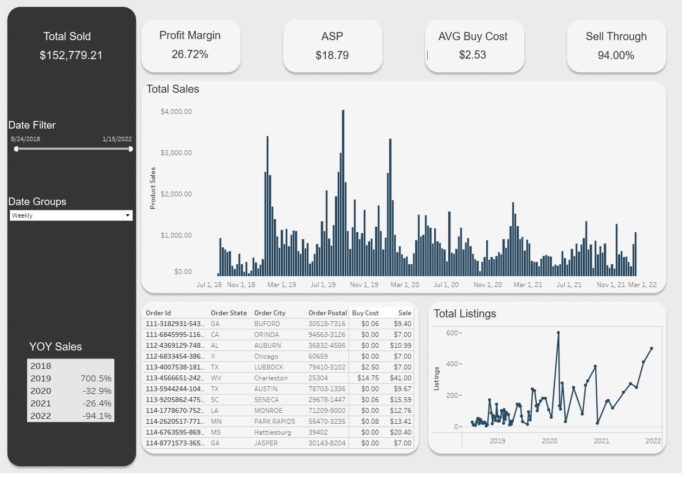

# Amazon-Sales-Dashboard

This project analyzes Amazon sales and listing data. The dashboard was created in Tableau([link here](https://public.tableau.com/views/AmazonSalesDashboard_16809435458350/Dashboard?:language=en-US&publish=yes&:display_count=n&:origin=viz_share_link)). The Jupyter Notebook can either be viewed in this repository or [here](https://clintbh.github.io/projects/amazonsalesdashboard/salesanalysis.html).

## Data Sources
* Amazon Sellers Active Listing Report
* Amazon Sellers Inventory Tracking
